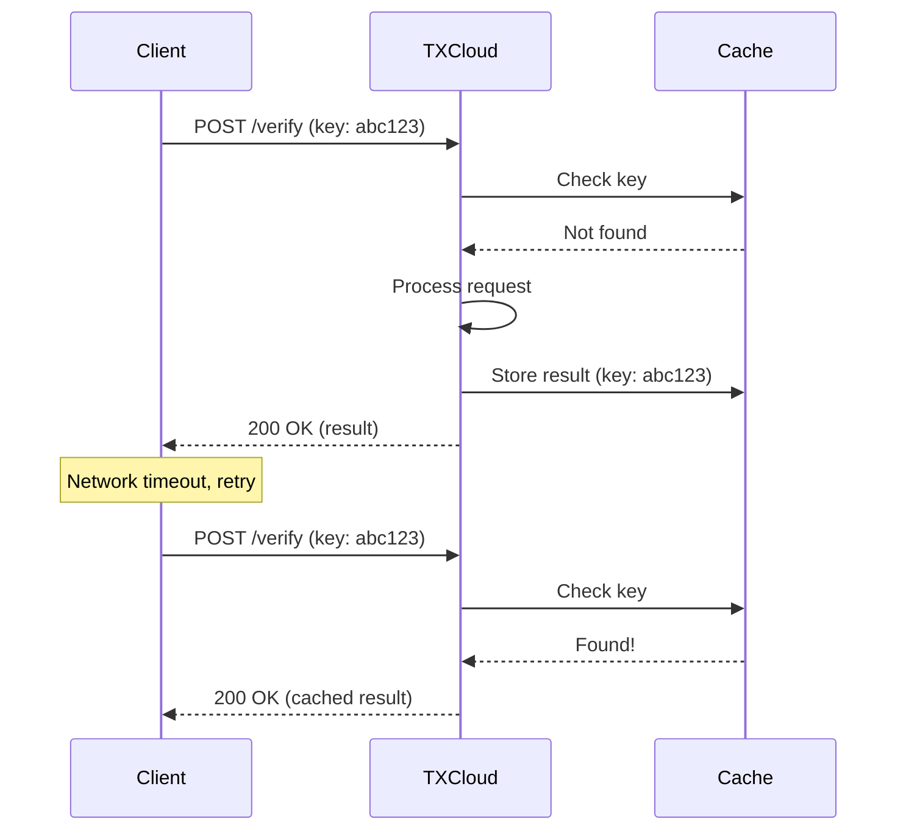

## Overview

Idempotency ensures that making the same API request multiple times produces the same result. This is crucial for reliable integrations, especially when network issues cause request failures.

## How It Works

Include an `Idempotency-Key` header with a unique value for each logical request:

```bash
curl -X POST https://api.txcloud.io/v1/identity/verify \
  -H "Authorization: Bearer $TXCLOUD_API_KEY" \
  -H "Idempotency-Key: user_123_verification_attempt_1" \
  -H "Content-Type: application/json" \
  -d '{"document_front": "...", "country": "MA"}'
```

If you send the same request with the same `Idempotency-Key`:
- **First request**: Processed normally, result stored
- **Subsequent requests**: Return cached result immediately



## Using Idempotency Keys

<CodeGroup>
```javascript JavaScript
import { v4 as uuidv4 } from 'uuid';

// Generate a unique key for each logical operation
const idempotencyKey = `verify_${userId}_${Date.now()}`;

const verification = await txcloud.identity.verify({
  document_front: documentBase64,
  country: 'MA'
}, {
  idempotencyKey: idempotencyKey
});
```

```python Python
import uuid

# Generate a unique key
idempotency_key = f"verify_{user_id}_{uuid.uuid4()}"

verification = txcloud.identity.verify(
    document_front=document_base64,
    country="MA",
    idempotency_key=idempotency_key
)
```

```bash cURL
curl -X POST https://api.txcloud.io/v1/identity/verify \
  -H "Authorization: Bearer $TXCLOUD_API_KEY" \
  -H "Idempotency-Key: $(uuidgen)" \
  -H "Content-Type: application/json" \
  -d '{"document_front": "...", "country": "MA"}'
```
</CodeGroup>

## Key Guidelines

### Key Format

| Requirement | Example |
|-------------|---------|
| **Length** | 10-255 characters |
| **Characters** | Alphanumeric, hyphens, underscores |
| **Uniqueness** | Must be unique per request type |

Good examples:
- `user_123_verify_2025-01-15T10:30:00Z`
- `order_456_payment_attempt_1`
- `550e8400-e29b-41d4-a716-446655440000`

### Key Expiration

Idempotency keys are stored for **24 hours**. After expiration:
- The same key can be reused
- The request will be processed as new

### Key Scope

Keys are scoped to:
- Your **API key**
- The **endpoint** being called

This means the same key can be used on different endpoints without conflict.

## Safe Retry Pattern

Implement retry logic with idempotency:

```javascript
async function safeRequest(fn, maxRetries = 3) {
  // Generate key once for all retries
  const idempotencyKey = uuidv4();
  
  for (let attempt = 0; attempt < maxRetries; attempt++) {
    try {
      return await fn(idempotencyKey);
    } catch (error) {
      // Safe to retry with same key
      if (isRetryable(error) && attempt < maxRetries - 1) {
        await sleep(1000 * Math.pow(2, attempt));
        continue;
      }
      throw error;
    }
  }
}

// Usage
const verification = await safeRequest((key) =>
  txcloud.identity.verify({
    document_front: doc,
    country: 'MA'
  }, { idempotencyKey: key })
);
```

## Response Headers

When a cached response is returned, TXCloud includes:

```http
HTTP/1.1 200 OK
Idempotency-Key: abc123
Idempotent-Replayed: true
X-Request-Id: req_original_123
```

| Header | Description |
|--------|-------------|
| `Idempotent-Replayed` | `true` if response was cached |
| `X-Request-Id` | ID of the original request |

## Handling Conflicts

If you send the same key with **different request bodies**, you'll get an error:

```json
{
  "error": {
    "code": "idempotency_key_conflict",
    "message": "Idempotency key already used with different request parameters",
    "type": "invalid_request_error"
  }
}
```

<Warning>
  Always use a new idempotency key for each unique request. Reusing keys with different parameters is an error.
</Warning>

## Endpoints Supporting Idempotency

| Endpoint | Supports Idempotency |
|----------|---------------------|
| `POST /identity/verify` | ✅ Yes |
| `POST /identity/sessions` | ✅ Yes |
| `POST /transactions/score` | ✅ Yes |
| `POST /lending/assess` | ✅ Yes |
| `POST /kyb/verify` | ✅ Yes |
| `POST /watchlist/screen` | ✅ Yes |
| `GET` endpoints | ❌ Already idempotent |
| `DELETE` endpoints | ❌ Already idempotent |

## Best Practices

<AccordionGroup>
  <Accordion title="Generate Keys Client-Side" icon="laptop-code">
    Generate idempotency keys in your application, not in TXCloud. This ensures retries use the same key.
  </Accordion>
  
  <Accordion title="Include Context in Keys" icon="tags">
    Make keys meaningful for debugging:
    ```javascript
    // Good: includes context
    const key = `user_${userId}_verify_${timestamp}`;
    
    // Less useful: random only
    const key = uuid();
    ```
  </Accordion>
  
  <Accordion title="Store Keys for Debugging" icon="database">
    Log idempotency keys with your requests for troubleshooting.
  </Accordion>
  
  <Accordion title="Don't Reuse Keys Across Operations" icon="ban">
    Each logical operation should have its own key:
    ```javascript
    // Wrong: same key for different operations
    const key = `user_${userId}`;
    await verify(key);
    await assess(key); // ❌ Conflict!
    
    // Right: unique key per operation
    await verify(`user_${userId}_verify_1`);
    await assess(`user_${userId}_assess_1`);
    ```
  </Accordion>
</AccordionGroup>

## Example: Payment Processing

A common use case for idempotency is payment processing:

```javascript
async function processPayment(userId, amount, orderId) {
  // Use orderId to ensure payment is processed only once
  const idempotencyKey = `payment_${orderId}`;
  
  // Even if this is called multiple times (e.g., user double-clicks)
  // the payment will only be processed once
  const score = await txcloud.transactions.score({
    transaction_id: orderId,
    amount: amount,
    currency: 'MAD',
    sender: { user_id: userId }
  }, {
    idempotencyKey: idempotencyKey
  });
  
  return score;
}

// Safe to call multiple times
await processPayment('user_123', 1000, 'order_456');
await processPayment('user_123', 1000, 'order_456'); // Returns cached
```

<Card title="API Reference" icon="code" href="/api-reference/overview">
  Learn more about request handling in the API Reference
</Card>
