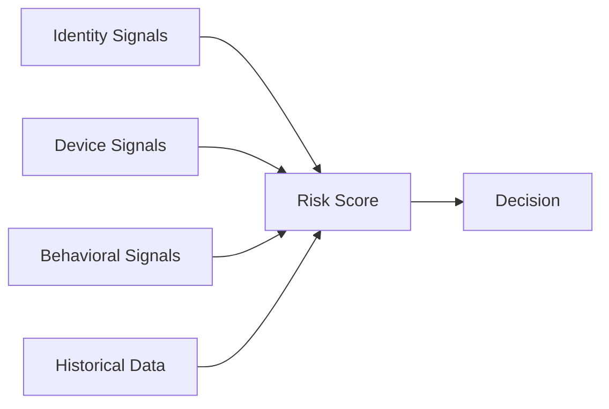

## Overview

TXCloud uses a unified **risk scoring system** across all APIs. Risk scores help you make informed decisions about users, transactions, and businesses.

## Score Scale

All TXCloud risk scores use a **0-1000 scale**:

| Score Range | Risk Level | Description |
|-------------|------------|-------------|
| 0-200 | 🟢 Very Low | Highly trusted, minimal risk |
| 201-400 | 🟢 Low | Normal, proceed with confidence |
| 401-600 | 🟡 Medium | Some concerns, consider review |
| 601-800 | 🟠 High | Significant risk, additional verification |
| 801-1000 | 🔴 Critical | Very high risk, likely block |

<Note>
  Higher scores = Higher risk. A score of 0 is the safest, 1000 is the riskiest.
</Note>

## Risk Score by API

### Identity Verification

```json
{
  "id": "ver_abc123",
  "status": "verified",
  "risk_score": 150,
  "risk_level": "low",
  "risk_factors": [
    { "code": "new_device", "weight": 50 },
    { "code": "document_age", "weight": 100 }
  ]
}
```

### Transaction Scoring

```json
{
  "id": "trs_abc123",
  "decision": "approve",
  "risk_score": 320,
  "risk_level": "medium",
  "signals": {
    "positive": ["known_recipient", "normal_amount"],
    "negative": ["new_device"],
    "neutral": ["weekend_transaction"]
  }
}
```

### Credit Assessment

```json
{
  "id": "lra_abc123",
  "credit_score": 720,  // 300-850 scale (traditional credit)
  "risk_score": 180,    // 0-1000 TXCloud scale
  "risk_level": "low",
  "grade": "B+"
}
```

## Score Components

Risk scores are calculated from multiple signals:



### Identity Signals

| Signal | Impact | Description |
|--------|--------|-------------|
| Document fraud | +300-500 | Tampering detected |
| Face mismatch | +200-400 | Selfie doesn't match document |
| Liveness failed | +300-500 | Not a live person |
| Data inconsistency | +100-200 | Extracted data conflicts |

### Device Signals

| Signal | Impact | Description |
|--------|--------|-------------|
| Known device | -50 | Previously verified device |
| New device | +50 | First time seeing device |
| VPN detected | +100-200 | VPN connection active |
| Emulator | +300 | Running in emulator |
| Rooted/jailbroken | +200 | Modified device |

### Behavioral Signals

| Signal | Impact | Description |
|--------|--------|-------------|
| Unusual amount | +100-200 | Outside normal range |
| Unusual time | +50-100 | Late night transaction |
| Velocity exceeded | +200-400 | Too many attempts |
| New recipient | +50 | First transfer to recipient |

## Using Risk Scores

### Decision Thresholds

Configure thresholds for automated decisions:

```javascript
const THRESHOLDS = {
  AUTO_APPROVE: 300,    // Score <= 300: auto-approve
  MANUAL_REVIEW: 600,   // 301-600: queue for review
  AUTO_DECLINE: 800     // Score > 800: auto-decline
};

function makeDecision(riskScore) {
  if (riskScore <= THRESHOLDS.AUTO_APPROVE) {
    return 'approve';
  } else if (riskScore <= THRESHOLDS.MANUAL_REVIEW) {
    return 'review';
  } else {
    return 'decline';
  }
}
```

### Custom Rules

Create rules that adjust scores based on your business logic:

```javascript
// Create a custom rule
await txcloud.fraud.rules.create({
  name: 'High Value New User',
  condition: 'user.age_days < 7 AND transaction.amount > 10000',
  action: 'review',
  score_adjustment: 200  // Add 200 to risk score
});
```

## Score Explanations

Always provide context for your decisions:

```javascript
const verification = await txcloud.identity.verify({ ... });

// Get human-readable explanation
const explanation = verification.risk_factors
  .map(f => `${f.code}: +${f.weight} points`)
  .join('\n');

console.log('Risk Factors:');
console.log(explanation);
// Output:
// Risk Factors:
// new_device: +50 points
// vpn_detected: +150 points
// unusual_time: +75 points
```

## Best Practices

<AccordionGroup>
  <Accordion title="Start Conservative, Adjust Over Time" icon="sliders">
    Begin with strict thresholds and loosen as you gather data:
    - Week 1-2: Manual review at score > 400
    - Week 3-4: Analyze false positive rate
    - Week 5+: Adjust thresholds based on data
  </Accordion>
  
  <Accordion title="Combine Scores with Context" icon="layer-group">
    Don't rely on score alone — consider:
    - User history
    - Transaction type
    - Business context
    - Time sensitivity
  </Accordion>
  
  <Accordion title="Log Everything" icon="file-lines">
    Store risk scores and factors for:
    - Compliance audits
    - Model improvement
    - Dispute resolution
  </Accordion>
  
  <Accordion title="Monitor Score Distribution" icon="chart-bar">
    Track your score distribution over time:
    - Sudden spikes may indicate attacks
    - Gradual shifts may indicate model drift
  </Accordion>
</AccordionGroup>

## Analytics

Track your risk metrics in the dashboard:

```javascript
const analytics = await txcloud.transactions.analytics.summary({
  period: '30d'
});

console.log('Risk Distribution:', analytics.risk_distribution);
// { low: 85000, medium: 12000, high: 2500, critical: 500 }

console.log('Fraud Rate:', analytics.fraud.fraud_rate);
// 0.00036 (0.036%)
```

<Card title="View Analytics Dashboard" icon="chart-line" href="https://dashboard.txcloud.io/analytics">
  Access detailed risk analytics in your dashboard
</Card>
