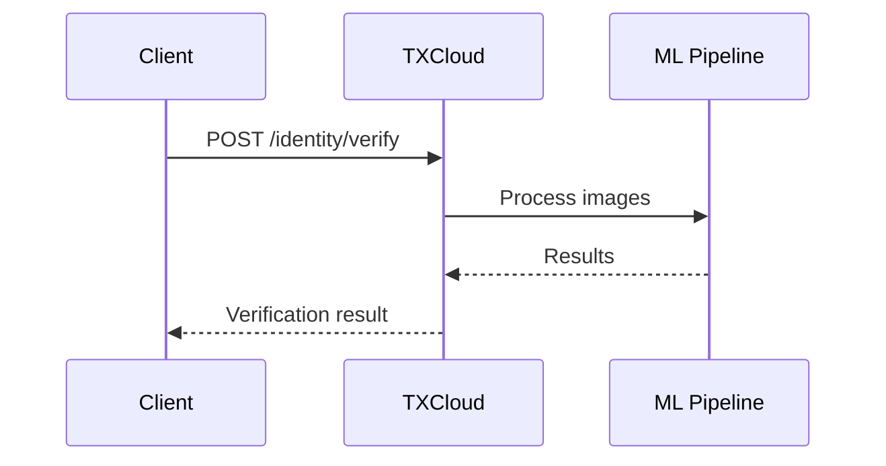
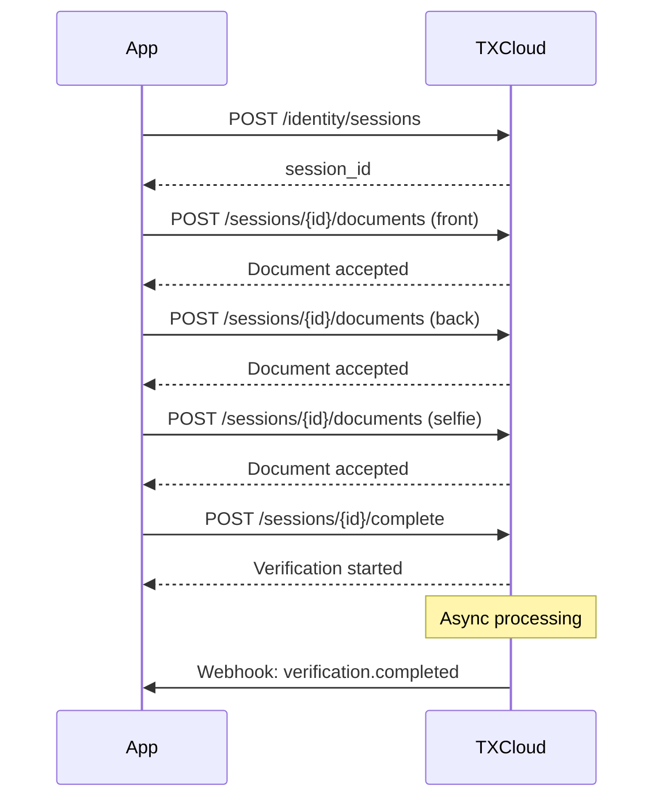

## Overview

TXCloud's verification flow is designed to be flexible, supporting both **synchronous** (instant) and **asynchronous** (session-based) verification patterns.

## Verification Methods

<CardGroup cols={2}>
  <Card title="Instant Verification" icon="bolt">
    Single API call with all images. Best for server-side integrations.
  </Card>
  <Card title="Session-Based" icon="layer-group">
    Multi-step upload flow. Best for mobile apps and web frontends.
  </Card>
</CardGroup>

## Instant Verification Flow

Use this when you have all documents ready to submit at once:



<CodeGroup>
```javascript JavaScript
const verification = await txcloud.identity.verify({
  document_front: documentFrontBase64,
  document_back: documentBackBase64,  // optional
  selfie: selfieBase64,
  country: 'MA',
  document_type: 'national_id',
  checks: ['ocr', 'face_match', 'liveness', 'fraud']
});
```

```python Python
verification = txcloud.identity.verify(
    document_front=document_front_base64,
    document_back=document_back_base64,
    selfie=selfie_base64,
    country="MA",
    document_type="national_id",
    checks=["ocr", "face_match", "liveness", "fraud"]
)
```
</CodeGroup>

## Session-Based Flow

Use this for mobile apps where users capture documents step-by-step:



### Step 1: Create Session

```javascript
const session = await txcloud.identity.sessions.create({
  country: 'MA',
  document_type: 'national_id',
  checks: ['ocr', 'face_match', 'liveness'],
  webhook_url: 'https://yourapp.com/webhooks'
});

// Returns session_id and upload URLs
console.log(session.id); // 'sess_a1b2c3d4'
```

### Step 2: Upload Documents

```javascript
// Upload document front
await txcloud.identity.sessions.uploadDocument(session.id, {
  type: 'document_front',
  image: documentFrontBase64
});

// Upload document back (if required)
await txcloud.identity.sessions.uploadDocument(session.id, {
  type: 'document_back',
  image: documentBackBase64
});

// Upload selfie
await txcloud.identity.sessions.uploadDocument(session.id, {
  type: 'selfie',
  image: selfieBase64
});
```

### Step 3: Complete Session

```javascript
const verification = await txcloud.identity.sessions.complete(session.id);

// For async processing, listen for webhook
// or poll the verification status
```

## Verification Checks

Each verification can include multiple checks:

| Check | Description | Time |
|-------|-------------|------|
| `ocr` | Extract text from document | ~1s |
| `face_match` | Compare selfie to document photo | ~1s |
| `liveness` | Detect if selfie is from live person | ~1s |
| `fraud` | Check for document tampering | ~2s |
| `data_validation` | Validate extracted data formats | ~0.5s |
| `age_verification` | Verify user meets minimum age | ~0.5s |

<Tip>
  Only include the checks you need — fewer checks = faster processing.
</Tip>

## Verification Statuses

| Status | Description | Final? |
|--------|-------------|--------|
| `pending` | Processing in progress | No |
| `verified` | All checks passed | Yes |
| `failed` | One or more checks failed | Yes |
| `expired` | Session expired before completion | Yes |
| `cancelled` | Verification was cancelled | Yes |
| `manual_review` | Requires human review | No |

## Handling Results

<CodeGroup>
```javascript JavaScript
const verification = await txcloud.identity.verifications.get(verificationId);

switch (verification.status) {
  case 'verified':
    // ✅ User verified - proceed with onboarding
    await onboardUser(verification.extracted_data);
    break;
    
  case 'failed':
    // ❌ Verification failed - check reasons
    const failures = verification.checks
      .filter(c => c.status === 'failed');
    await handleFailure(failures);
    break;
    
  case 'manual_review':
    // 👀 Needs human review
    await queueForReview(verification.id);
    break;
}
```

```python Python
verification = txcloud.identity.verifications.get(verification_id)

if verification.status == "verified":
    # ✅ User verified
    onboard_user(verification.extracted_data)
elif verification.status == "failed":
    # ❌ Verification failed
    failures = [c for c in verification.checks if c.status == "failed"]
    handle_failure(failures)
elif verification.status == "manual_review":
    # 👀 Needs human review
    queue_for_review(verification.id)
```
</CodeGroup>

## Best Practices

<AccordionGroup>
  <Accordion title="Validate Images Before Upload" icon="image">
    Check image quality client-side:
    - Minimum resolution: 1280x720
    - File size: Under 10MB
    - Format: JPEG or PNG
    - No blur or glare
  </Accordion>
  
  <Accordion title="Use Webhooks for Async" icon="webhook">
    Don't poll — use webhooks for real-time updates on session-based verification.
  </Accordion>
  
  <Accordion title="Handle All Statuses" icon="list-check">
    Implement handlers for every possible status, including edge cases like `expired`.
  </Accordion>
  
  <Accordion title="Store Verification IDs" icon="database">
    Always store the verification ID for future reference and audit trails.
  </Accordion>
</AccordionGroup>

## Next Steps

<CardGroup cols={2}>
  <Card title="Identity API Reference" icon="code" href="/api-reference/overview">
    Explore all Identity endpoints
  </Card>
  <Card title="Fraud Detection Guide" icon="shield" href="/guides/fraud-detection">
    Add fraud detection to your flow
  </Card>
</CardGroup>
