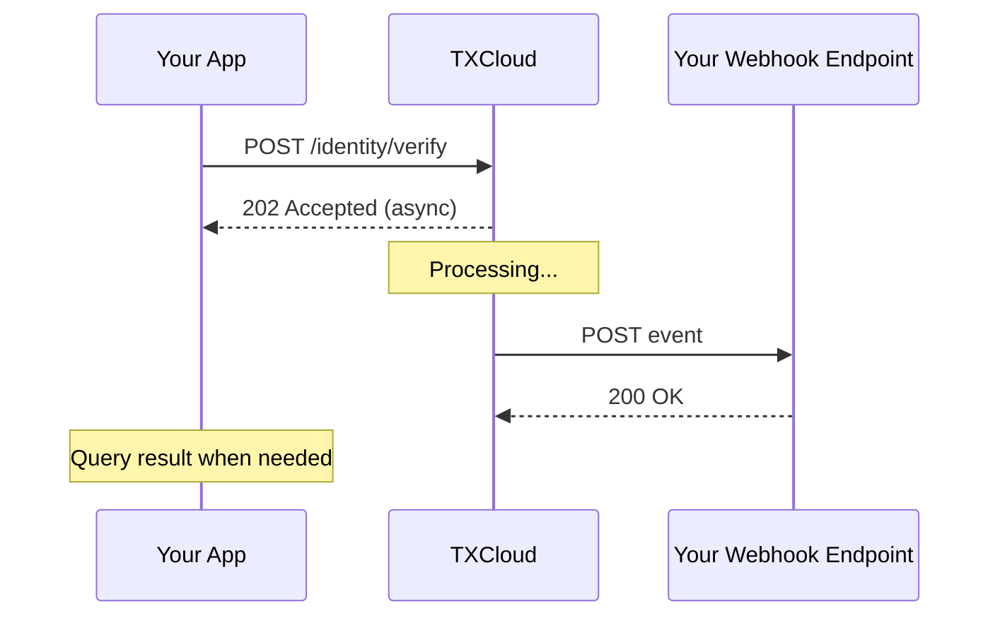

## Overview

Webhooks allow TXCloud to push real-time notifications to your server when events occur. Instead of polling our API, you receive updates automatically.

## How Webhooks Work



## Setting Up Webhooks

### Step 1: Create a Webhook Endpoint

Create an endpoint on your server to receive webhook events:

```javascript
// Express.js example
app.post('/webhooks/txcloud', express.raw({ type: 'application/json' }), (req, res) => {
  const signature = req.headers['x-txcloud-signature'];
  const payload = req.body;
  
  // Verify signature
  if (!verifySignature(payload, signature, webhookSecret)) {
    return res.status(401).send('Invalid signature');
  }
  
  const event = JSON.parse(payload);
  
  // Handle the event
  switch (event.type) {
    case 'identity.verification.completed':
      handleVerificationCompleted(event.data);
      break;
    case 'fraud.signal.detected':
      handleFraudSignal(event.data);
      break;
    default:
      console.log(`Unhandled event type: ${event.type}`);
  }
  
  res.status(200).send('OK');
});
```

### Step 2: Register Your Webhook

<CodeGroup>
```javascript JavaScript
const webhook = await txcloud.developers.webhooks.create({
  url: 'https://yourapp.com/webhooks/txcloud',
  events: [
    'identity.verification.completed',
    'identity.verification.failed',
    'transaction.scored',
    'fraud.signal.detected'
  ],
  description: 'Production webhook'
});

// Save the secret for signature verification
console.log('Webhook Secret:', webhook.secret);
```

```bash cURL
curl -X POST https://api.txcloud.io/v1/developers/webhooks \
  -H "Authorization: Bearer $TXCLOUD_API_KEY" \
  -H "Content-Type: application/json" \
  -d '{
    "url": "https://yourapp.com/webhooks/txcloud",
    "events": ["identity.verification.completed"]
  }'
```
</CodeGroup>

## Webhook Events

### Identity Events

| Event | Description |
|-------|-------------|
| `identity.verification.completed` | Verification finished successfully |
| `identity.verification.failed` | Verification failed |
| `identity.session.expired` | Session expired before completion |

### Fraud Events

| Event | Description |
|-------|-------------|
| `fraud.signal.detected` | Fraud signal detected |
| `fraud.device.blocked` | Device added to blocklist |
| `fraud.rule.triggered` | Custom rule was triggered |

### Transaction Events

| Event | Description |
|-------|-------------|
| `transaction.scored` | Transaction was scored |
| `transaction.review_required` | Manual review needed |
| `transaction.fraud_detected` | Fraud confirmed |

### Lending Events

| Event | Description |
|-------|-------------|
| `lending.assessment.completed` | Credit assessment finished |
| `lending.statement.analyzed` | Bank statement analysis complete |
| `lending.monitor.alert` | Monitoring alert triggered |

### Watchlist Events

| Event | Description |
|-------|-------------|
| `watchlist.screening.completed` | Screening finished |
| `watchlist.match.found` | Potential match found |
| `watchlist.monitor.alert` | Ongoing monitoring alert |

## Event Payload

All webhook events follow this structure:

```json
{
  "id": "evt_a1b2c3d4e5f6",
  "type": "identity.verification.completed",
  "created_at": "2025-01-15T10:30:00Z",
  "api_version": "2025-01-01",
  "data": {
    "id": "ver_xyz789",
    "status": "verified",
    "extracted_data": { ... },
    "checks": { ... }
  }
}
```

| Field | Type | Description |
|-------|------|-------------|
| `id` | string | Unique event ID |
| `type` | string | Event type |
| `created_at` | datetime | When event was created |
| `api_version` | string | API version used |
| `data` | object | Event-specific payload |

## Signature Verification

<Warning>
  **Always verify webhook signatures** to ensure events are from TXCloud.
</Warning>

TXCloud signs all webhook payloads using HMAC-SHA256:

```javascript
const crypto = require('crypto');

function verifySignature(payload, signature, secret) {
  const expectedSignature = crypto
    .createHmac('sha256', secret)
    .update(payload, 'utf8')
    .digest('hex');
  
  const signatureBuffer = Buffer.from(signature, 'hex');
  const expectedBuffer = Buffer.from(expectedSignature, 'hex');
  
  return crypto.timingSafeEqual(signatureBuffer, expectedBuffer);
}
```

The signature is sent in the `X-TXCloud-Signature` header:

```http
POST /webhooks/txcloud HTTP/1.1
Host: yourapp.com
Content-Type: application/json
X-TXCloud-Signature: a1b2c3d4e5f6...
X-TXCloud-Timestamp: 1705312800

{"id": "evt_abc123", ...}
```

## Retry Policy

If your endpoint fails to respond with a 2xx status, TXCloud will retry:

| Attempt | Delay |
|---------|-------|
| 1 | Immediate |
| 2 | 1 minute |
| 3 | 5 minutes |
| 4 | 30 minutes |
| 5 | 2 hours |
| 6 | 12 hours |
| 7 | 24 hours |

After 7 failed attempts, the webhook is marked as failed and we'll notify you via email.

<Tip>
  Return a 2xx response as quickly as possible. Process events asynchronously to avoid timeouts.
</Tip>

## Best Practices

<AccordionGroup>
  <Accordion title="Respond Quickly" icon="bolt">
    Return a 200 response immediately, then process asynchronously:
    ```javascript
    app.post('/webhooks', (req, res) => {
      // Respond immediately
      res.status(200).send('OK');
      
      // Process asynchronously
      processEvent(req.body).catch(console.error);
    });
    ```
  </Accordion>
  
  <Accordion title="Handle Duplicates" icon="clone">
    Events may be delivered more than once. Use the event `id` for idempotency:
    ```javascript
    if (await eventAlreadyProcessed(event.id)) {
      return; // Skip duplicate
    }
    ```
  </Accordion>
  
  <Accordion title="Use a Queue" icon="list">
    For high-volume webhooks, push events to a queue:
    - Amazon SQS
    - Redis Queue
    - RabbitMQ
  </Accordion>
  
  <Accordion title="Monitor Delivery" icon="chart-line">
    Check webhook delivery status in your dashboard. Failed webhooks are logged with error details.
  </Accordion>
</AccordionGroup>

## Testing Webhooks

### Send a Test Event

```javascript
// Send a test event to your endpoint
await txcloud.developers.webhooks.test(webhookId, {
  event_type: 'identity.verification.completed'
});
```

### Local Development

Use a tunneling service for local testing:

```bash
# Using ngrok
ngrok http 3000

# Your local endpoint becomes accessible at:
# https://abc123.ngrok.io/webhooks/txcloud
```

## Webhook Logs

View delivery logs in the dashboard or via API:

```javascript
const logs = await txcloud.developers.webhooks.deliveries(webhookId, {
  limit: 20,
  status: 'failed'  // or 'success'
});

logs.data.forEach(log => {
  console.log(`${log.event_type}: ${log.response_status} - ${log.created_at}`);
});
```

<Card title="Webhook Dashboard" icon="desktop" href="https://dashboard.txcloud.io/webhooks">
  View and manage webhooks in your dashboard
</Card>
