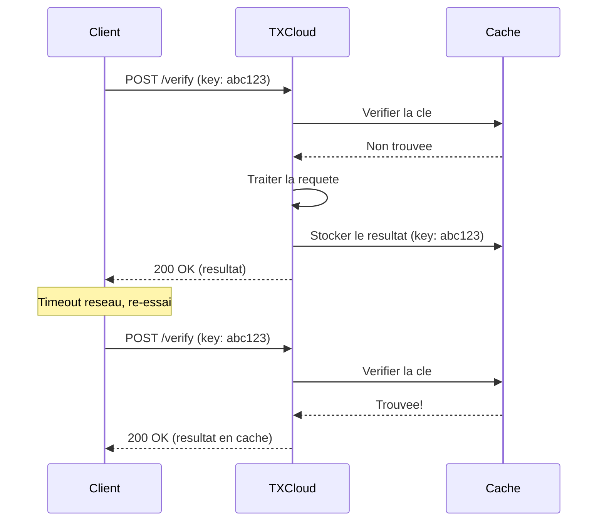

## Apercu

L'idempotence garantit que faire la meme requete API plusieurs fois produit le meme resultat. C'est crucial pour des integrations fiables, surtout lorsque des problemes reseau causent des echecs de requete.

## Comment ca Fonctionne

Incluez un en-tete `Idempotency-Key` avec une valeur unique pour chaque requete logique :

```bash
curl -X POST https://api.txcloud.io/v1/identity/verify \
  -H "Authorization: Bearer $TXCLOUD_API_KEY" \
  -H "Idempotency-Key: user_123_verification_tentative_1" \
  -H "Content-Type: application/json" \
  -d '{"document_front": "...", "country": "MA"}'
```

Si vous envoyez la meme requete avec la meme `Idempotency-Key` :
- **Premiere requete** : Traitee normalement, resultat stocke
- **Requetes suivantes** : Retournent le resultat en cache immediatement



## Utiliser les Cles d'Idempotence

<CodeGroup>
```javascript JavaScript
import { v4 as uuidv4 } from 'uuid';

// Generer une cle unique pour chaque operation logique
const idempotencyKey = `verify_${userId}_${Date.now()}`;

const verification = await txcloud.identity.verify({
  document_front: documentBase64,
  country: 'MA'
}, {
  idempotencyKey: idempotencyKey
});
```

```python Python
import uuid

# Generer une cle unique
idempotency_key = f"verify_{user_id}_{uuid.uuid4()}"

verification = txcloud.identity.verify(
    document_front=document_base64,
    country="MA",
    idempotency_key=idempotency_key
)
```

```bash cURL
curl -X POST https://api.txcloud.io/v1/identity/verify \
  -H "Authorization: Bearer $TXCLOUD_API_KEY" \
  -H "Idempotency-Key: $(uuidgen)" \
  -H "Content-Type: application/json" \
  -d '{"document_front": "...", "country": "MA"}'
```
</CodeGroup>

## Directives pour les Cles

### Format de Cle

| Exigence | Exemple |
|----------|---------|
| **Longueur** | 10-255 caracteres |
| **Caracteres** | Alphanumeriques, tirets, underscores |
| **Unicite** | Doit etre unique par type de requete |

Bons exemples :
- `user_123_verify_2025-01-15T10:30:00Z`
- `order_456_payment_tentative_1`
- `550e8400-e29b-41d4-a716-446655440000`

### Expiration des Cles

Les cles d'idempotence sont stockees pendant **24 heures**. Apres expiration :
- La meme cle peut etre reutilisee
- La requete sera traitee comme nouvelle

### Portee des Cles

Les cles sont limitees a :
- Votre **cle API**
- L'**endpoint** appele

Cela signifie que la meme cle peut etre utilisee sur differents endpoints sans conflit.

## Pattern de Re-essai Securise

Implementez une logique de re-essai avec l'idempotence :

```javascript
async function safeRequest(fn, maxRetries = 3) {
  // Generer la cle une fois pour tous les re-essais
  const idempotencyKey = uuidv4();

  for (let attempt = 0; attempt < maxRetries; attempt++) {
    try {
      return await fn(idempotencyKey);
    } catch (error) {
      // Sur de reessayer avec la meme cle
      if (isRetryable(error) && attempt < maxRetries - 1) {
        await sleep(1000 * Math.pow(2, attempt));
        continue;
      }
      throw error;
    }
  }
}

// Utilisation
const verification = await safeRequest((key) =>
  txcloud.identity.verify({
    document_front: doc,
    country: 'MA'
  }, { idempotencyKey: key })
);
```

## En-tetes de Reponse

Lorsqu'une reponse en cache est retournee, TXCloud inclut :

```http
HTTP/1.1 200 OK
Idempotency-Key: abc123
Idempotent-Replayed: true
X-Request-Id: req_original_123
```

| En-tete | Description |
|---------|-------------|
| `Idempotent-Replayed` | `true` si la reponse etait en cache |
| `X-Request-Id` | ID de la requete originale |

## Gerer les Conflits

Si vous envoyez la meme cle avec des **corps de requete differents**, vous obtiendrez une erreur :

```json
{
  "error": {
    "code": "idempotency_key_conflict",
    "message": "Cle d'idempotence deja utilisee avec des parametres de requete differents",
    "type": "invalid_request_error"
  }
}
```

<Warning>
  Utilisez toujours une nouvelle cle d'idempotence pour chaque requete unique. Reutiliser des cles avec des parametres differents est une erreur.
</Warning>

## Endpoints Supportant l'Idempotence

| Endpoint | Supporte l'Idempotence |
|----------|------------------------|
| `POST /identity/verify` | Oui |
| `POST /identity/sessions` | Oui |
| `POST /transactions/score` | Oui |
| `POST /lending/assess` | Oui |
| `POST /kyb/verify` | Oui |
| `POST /watchlist/screen` | Oui |
| `GET` endpoints | Deja idempotent |
| `DELETE` endpoints | Deja idempotent |

## Bonnes Pratiques

<AccordionGroup>
  <Accordion title="Generez les Cles Cote Client" icon="laptop-code">
    Generez les cles d'idempotence dans votre application, pas dans TXCloud. Cela garantit que les re-essais utilisent la meme cle.
  </Accordion>

  <Accordion title="Incluez du Contexte dans les Cles" icon="tags">
    Rendez les cles significatives pour le debogage :
    ```javascript
    // Bon : inclut le contexte
    const key = `user_${userId}_verify_${timestamp}`;

    // Moins utile : aleatoire seulement
    const key = uuid();
    ```
  </Accordion>

  <Accordion title="Stockez les Cles pour le Debogage" icon="database">
    Journalisez les cles d'idempotence avec vos requetes pour le depannage.
  </Accordion>

  <Accordion title="Ne Reutilisez Pas les Cles Entre Operations" icon="ban">
    Chaque operation logique doit avoir sa propre cle :
    ```javascript
    // Faux : meme cle pour differentes operations
    const key = `user_${userId}`;
    await verify(key);
    await assess(key); // Conflit!

    // Correct : cle unique par operation
    await verify(`user_${userId}_verify_1`);
    await assess(`user_${userId}_assess_1`);
    ```
  </Accordion>
</AccordionGroup>

## Exemple : Traitement de Paiement

Un cas d'utilisation courant pour l'idempotence est le traitement des paiements :

```javascript
async function processPayment(userId, amount, orderId) {
  // Utilisez orderId pour garantir que le paiement n'est traite qu'une fois
  const idempotencyKey = `payment_${orderId}`;

  // Meme si ceci est appele plusieurs fois (ex: double-clic utilisateur)
  // le paiement ne sera traite qu'une seule fois
  const score = await txcloud.transactions.score({
    transaction_id: orderId,
    amount: amount,
    currency: 'MAD',
    sender: { user_id: userId }
  }, {
    idempotencyKey: idempotencyKey
  });

  return score;
}

// Sur d'appeler plusieurs fois
await processPayment('user_123', 1000, 'order_456');
await processPayment('user_123', 1000, 'order_456'); // Retourne le cache
```

<Card title="Reference API" icon="code" href="/api-reference/overview">
  En savoir plus sur la gestion des requetes dans la Reference API
</Card>
