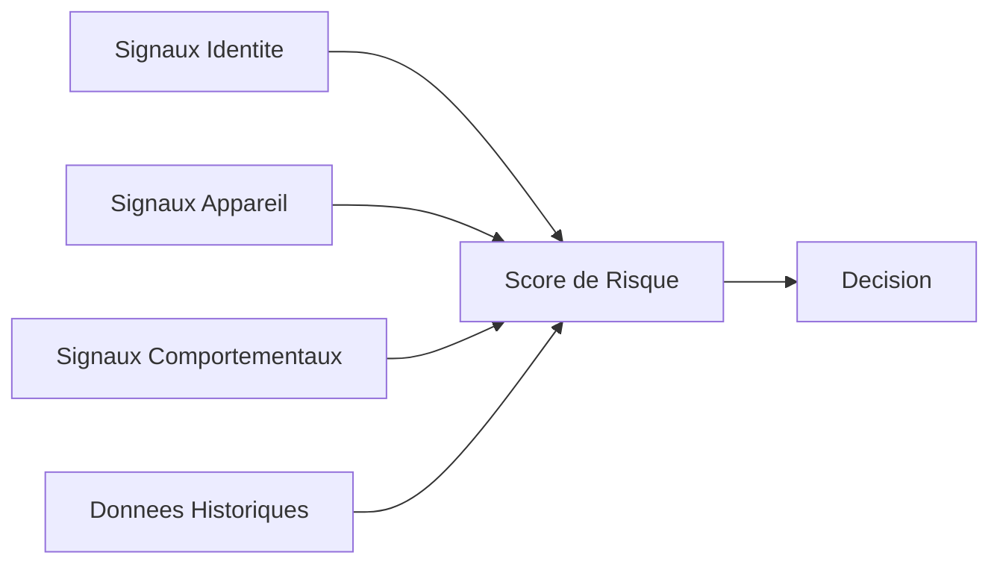

## Apercu

TXCloud utilise un **systeme de scoring de risque unifie** a travers toutes les APIs. Les scores de risque vous aident a prendre des decisions eclairees sur les utilisateurs, les transactions et les entreprises.

## Echelle de Score

Tous les scores de risque TXCloud utilisent une **echelle de 0 a 1000** :

| Plage de Score | Niveau de Risque | Description |
|----------------|------------------|-------------|
| 0-200 | Tres Faible | Hautement fiable, risque minimal |
| 201-400 | Faible | Normal, procedez avec confiance |
| 401-600 | Moyen | Quelques preoccupations, envisagez une revision |
| 601-800 | Eleve | Risque significatif, verification supplementaire |
| 801-1000 | Critique | Risque tres eleve, probablement bloquer |

<Note>
  Scores plus eleves = Risque plus eleve. Un score de 0 est le plus sur, 1000 est le plus risque.
</Note>

## Score de Risque par API

### Verification d'Identite

```json
{
  "id": "ver_abc123",
  "status": "verified",
  "risk_score": 150,
  "risk_level": "low",
  "risk_factors": [
    { "code": "new_device", "weight": 50 },
    { "code": "document_age", "weight": 100 }
  ]
}
```

### Scoring de Transaction

```json
{
  "id": "trs_abc123",
  "decision": "approve",
  "risk_score": 320,
  "risk_level": "medium",
  "signals": {
    "positive": ["known_recipient", "normal_amount"],
    "negative": ["new_device"],
    "neutral": ["weekend_transaction"]
  }
}
```

### Evaluation de Credit

```json
{
  "id": "lra_abc123",
  "credit_score": 720,  // echelle 300-850 (credit traditionnel)
  "risk_score": 180,    // echelle TXCloud 0-1000
  "risk_level": "low",
  "grade": "B+"
}
```

## Composants du Score

Les scores de risque sont calcules a partir de multiples signaux :



### Signaux d'Identite

| Signal | Impact | Description |
|--------|--------|-------------|
| Fraude documentaire | +300-500 | Falsification detectee |
| Non-correspondance faciale | +200-400 | Le selfie ne correspond pas au document |
| Echec de vivacite | +300-500 | Pas une personne vivante |
| Incoherence des donnees | +100-200 | Les donnees extraites sont en conflit |

### Signaux d'Appareil

| Signal | Impact | Description |
|--------|--------|-------------|
| Appareil connu | -50 | Appareil precedemment verifie |
| Nouvel appareil | +50 | Premiere fois que l'appareil est vu |
| VPN detecte | +100-200 | Connexion VPN active |
| Emulateur | +300 | Execution dans un emulateur |
| Root/jailbreak | +200 | Appareil modifie |

### Signaux Comportementaux

| Signal | Impact | Description |
|--------|--------|-------------|
| Montant inhabituel | +100-200 | En dehors de la plage normale |
| Heure inhabituelle | +50-100 | Transaction tard dans la nuit |
| Velocite depassee | +200-400 | Trop de tentatives |
| Nouveau destinataire | +50 | Premier transfert vers ce destinataire |

## Utiliser les Scores de Risque

### Seuils de Decision

Configurez des seuils pour des decisions automatisees :

```javascript
const SEUILS = {
  APPROBATION_AUTO: 300,    // Score <= 300 : approbation automatique
  REVISION_MANUELLE: 600,   // 301-600 : mise en file d'attente pour revision
  REFUS_AUTO: 800           // Score > 800 : refus automatique
};

function prendreDecision(scoreRisque) {
  if (scoreRisque <= SEUILS.APPROBATION_AUTO) {
    return 'approuver';
  } else if (scoreRisque <= SEUILS.REVISION_MANUELLE) {
    return 'reviser';
  } else {
    return 'refuser';
  }
}
```

### Regles Personnalisees

Creez des regles qui ajustent les scores selon votre logique metier :

```javascript
// Creer une regle personnalisee
await txcloud.fraud.rules.create({
  name: 'Nouvel Utilisateur Haute Valeur',
  condition: 'user.age_days < 7 AND transaction.amount > 10000',
  action: 'review',
  score_adjustment: 200  // Ajouter 200 au score de risque
});
```

## Explications des Scores

Fournissez toujours du contexte pour vos decisions :

```javascript
const verification = await txcloud.identity.verify({ ... });

// Obtenir une explication lisible par l'humain
const explication = verification.risk_factors
  .map(f => `${f.code}: +${f.weight} points`)
  .join('\n');

console.log('Facteurs de Risque:');
console.log(explication);
// Sortie:
// Facteurs de Risque:
// new_device: +50 points
// vpn_detected: +150 points
// unusual_time: +75 points
```

## Bonnes Pratiques

<AccordionGroup>
  <Accordion title="Commencez Conservateur, Ajustez au Fil du Temps" icon="sliders">
    Commencez avec des seuils stricts et assouplissez en collectant des donnees :
    - Semaine 1-2 : Revision manuelle au score > 400
    - Semaine 3-4 : Analysez le taux de faux positifs
    - Semaine 5+ : Ajustez les seuils selon les donnees
  </Accordion>

  <Accordion title="Combinez les Scores avec le Contexte" icon="layer-group">
    Ne vous fiez pas uniquement au score - considerez :
    - L'historique utilisateur
    - Le type de transaction
    - Le contexte metier
    - La sensibilite temporelle
  </Accordion>

  <Accordion title="Journalisez Tout" icon="file-lines">
    Stockez les scores de risque et les facteurs pour :
    - Les audits de conformite
    - L'amelioration des modeles
    - La resolution des litiges
  </Accordion>

  <Accordion title="Surveillez la Distribution des Scores" icon="chart-bar">
    Suivez votre distribution de scores dans le temps :
    - Des pics soudains peuvent indiquer des attaques
    - Des changements graduels peuvent indiquer une derive du modele
  </Accordion>
</AccordionGroup>

## Analytics

Suivez vos metriques de risque dans le tableau de bord :

```javascript
const analytics = await txcloud.transactions.analytics.summary({
  period: '30d'
});

console.log('Distribution des Risques:', analytics.risk_distribution);
// { low: 85000, medium: 12000, high: 2500, critical: 500 }

console.log('Taux de Fraude:', analytics.fraud.fraud_rate);
// 0.00036 (0.036%)
```

<Card title="Voir le Tableau de Bord Analytics" icon="chart-line" href="https://dashboard.txcloud.io/analytics">
  Accedez aux analytics de risque detailles dans votre tableau de bord
</Card>
