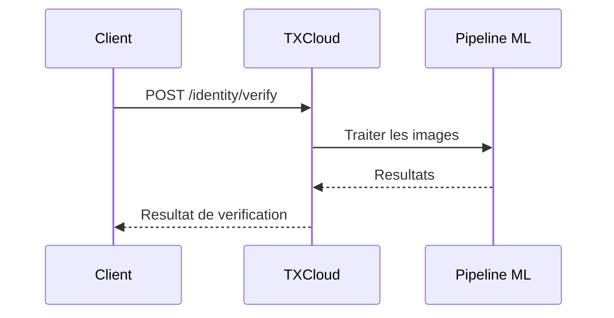
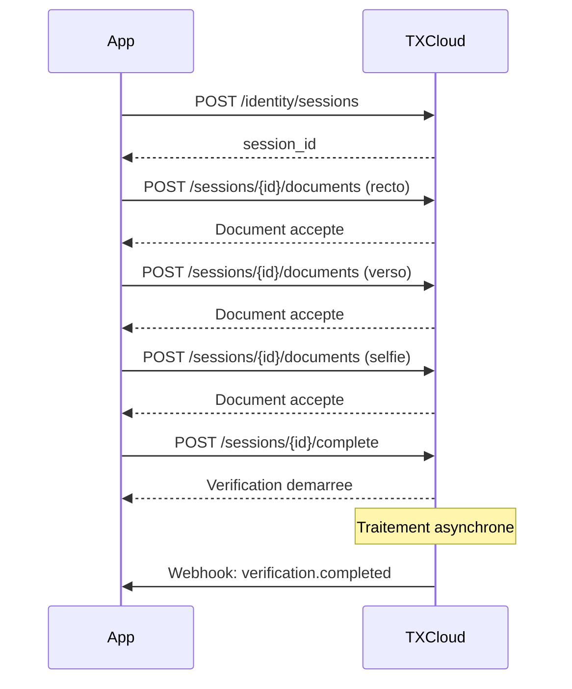

## Apercu

Le flux de verification de TXCloud est concu pour etre flexible, prenant en charge les patterns de verification **synchrones** (instantanes) et **asynchrones** (bases sur des sessions).

## Methodes de Verification

<CardGroup cols={2}>
  <Card title="Verification Instantanee" icon="bolt">
    Un seul appel API avec toutes les images. Ideal pour les integrations cote serveur.
  </Card>
  <Card title="Basee sur Session" icon="layer-group">
    Flux de telechargement en plusieurs etapes. Ideal pour les apps mobiles et les frontends web.
  </Card>
</CardGroup>

## Flux de Verification Instantanee

Utilisez ceci lorsque vous avez tous les documents prets a soumettre en une fois :



<CodeGroup>
```javascript JavaScript
const verification = await txcloud.identity.verify({
  document_front: documentFrontBase64,
  document_back: documentBackBase64,  // optionnel
  selfie: selfieBase64,
  country: 'MA',
  document_type: 'national_id',
  checks: ['ocr', 'face_match', 'liveness', 'fraud']
});
```

```python Python
verification = txcloud.identity.verify(
    document_front=document_front_base64,
    document_back=document_back_base64,
    selfie=selfie_base64,
    country="MA",
    document_type="national_id",
    checks=["ocr", "face_match", "liveness", "fraud"]
)
```
</CodeGroup>

## Flux Base sur Session

Utilisez ceci pour les apps mobiles ou les utilisateurs capturent les documents etape par etape :



### Etape 1 : Creer une Session

```javascript
const session = await txcloud.identity.sessions.create({
  country: 'MA',
  document_type: 'national_id',
  checks: ['ocr', 'face_match', 'liveness'],
  webhook_url: 'https://votreapp.com/webhooks'
});

// Retourne session_id et URLs de telechargement
console.log(session.id); // 'sess_a1b2c3d4'
```

### Etape 2 : Telecharger les Documents

```javascript
// Telecharger le recto du document
await txcloud.identity.sessions.uploadDocument(session.id, {
  type: 'document_front',
  image: documentFrontBase64
});

// Telecharger le verso du document (si requis)
await txcloud.identity.sessions.uploadDocument(session.id, {
  type: 'document_back',
  image: documentBackBase64
});

// Telecharger le selfie
await txcloud.identity.sessions.uploadDocument(session.id, {
  type: 'selfie',
  image: selfieBase64
});
```

### Etape 3 : Completer la Session

```javascript
const verification = await txcloud.identity.sessions.complete(session.id);

// Pour le traitement async, ecoutez le webhook
// ou interrogez le statut de verification
```

## Controles de Verification

Chaque verification peut inclure plusieurs controles :

| Controle | Description | Temps |
|----------|-------------|-------|
| `ocr` | Extraire le texte du document | ~1s |
| `face_match` | Comparer le selfie a la photo du document | ~1s |
| `liveness` | Detecter si le selfie est d'une personne vivante | ~1s |
| `fraud` | Verifier la falsification du document | ~2s |
| `data_validation` | Valider les formats des donnees extraites | ~0.5s |
| `age_verification` | Verifier que l'utilisateur a l'age minimum | ~0.5s |

<Tip>
  N'incluez que les controles dont vous avez besoin - moins de controles = traitement plus rapide.
</Tip>

## Statuts de Verification

| Statut | Description | Final ? |
|--------|-------------|---------|
| `pending` | Traitement en cours | Non |
| `verified` | Tous les controles passes | Oui |
| `failed` | Un ou plusieurs controles echoues | Oui |
| `expired` | Session expiree avant completion | Oui |
| `cancelled` | Verification annulee | Oui |
| `manual_review` | Necessite une revision humaine | Non |

## Gerer les Resultats

<CodeGroup>
```javascript JavaScript
const verification = await txcloud.identity.verifications.get(verificationId);

switch (verification.status) {
  case 'verified':
    // Utilisateur verifie - procedez a l'onboarding
    await onboardUser(verification.extracted_data);
    break;

  case 'failed':
    // Verification echouee - verifiez les raisons
    const failures = verification.checks
      .filter(c => c.status === 'failed');
    await handleFailure(failures);
    break;

  case 'manual_review':
    // Necessite une revision humaine
    await queueForReview(verification.id);
    break;
}
```

```python Python
verification = txcloud.identity.verifications.get(verification_id)

if verification.status == "verified":
    # Utilisateur verifie
    onboard_user(verification.extracted_data)
elif verification.status == "failed":
    # Verification echouee
    failures = [c for c in verification.checks if c.status == "failed"]
    handle_failure(failures)
elif verification.status == "manual_review":
    # Necessite une revision humaine
    queue_for_review(verification.id)
```
</CodeGroup>

## Bonnes Pratiques

<AccordionGroup>
  <Accordion title="Validez les Images Avant le Telechargement" icon="image">
    Verifiez la qualite de l'image cote client :
    - Resolution minimum : 1280x720
    - Taille du fichier : Moins de 10MB
    - Format : JPEG ou PNG
    - Pas de flou ou de reflets
  </Accordion>

  <Accordion title="Utilisez les Webhooks pour l'Async" icon="webhook">
    N'interrogez pas - utilisez les webhooks pour des mises a jour en temps reel sur la verification basee sur session.
  </Accordion>

  <Accordion title="Gerez Tous les Statuts" icon="list-check">
    Implementez des gestionnaires pour chaque statut possible, y compris les cas limites comme `expired`.
  </Accordion>

  <Accordion title="Stockez les IDs de Verification" icon="database">
    Stockez toujours l'ID de verification pour reference future et pistes d'audit.
  </Accordion>
</AccordionGroup>

## Prochaines Etapes

<CardGroup cols={2}>
  <Card title="Reference API Identity" icon="code" href="/api-reference/overview">
    Explorez tous les endpoints Identity
  </Card>
  <Card title="Guide Detection de Fraude" icon="shield" href="/fr/guides/fraud-detection">
    Ajoutez la detection de fraude a votre flux
  </Card>
</CardGroup>
