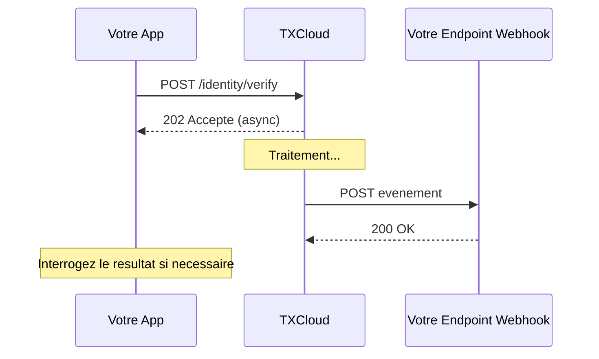

## Apercu

Les webhooks permettent a TXCloud d'envoyer des notifications en temps reel a votre serveur lorsque des evenements se produisent. Au lieu d'interroger notre API, vous recevez les mises a jour automatiquement.

## Comment Fonctionnent les Webhooks



## Configurer les Webhooks

### Etape 1 : Creer un Endpoint Webhook

Creez un endpoint sur votre serveur pour recevoir les evenements webhook :

```javascript
// Exemple Express.js
app.post('/webhooks/txcloud', express.raw({ type: 'application/json' }), (req, res) => {
  const signature = req.headers['x-txcloud-signature'];
  const payload = req.body;

  // Verifier la signature
  if (!verifySignature(payload, signature, webhookSecret)) {
    return res.status(401).send('Signature invalide');
  }

  const event = JSON.parse(payload);

  // Gerer l'evenement
  switch (event.type) {
    case 'identity.verification.completed':
      handleVerificationCompleted(event.data);
      break;
    case 'fraud.signal.detected':
      handleFraudSignal(event.data);
      break;
    default:
      console.log(`Type d'evenement non gere: ${event.type}`);
  }

  res.status(200).send('OK');
});
```

### Etape 2 : Enregistrer Votre Webhook

<CodeGroup>
```javascript JavaScript
const webhook = await txcloud.developers.webhooks.create({
  url: 'https://votreapp.com/webhooks/txcloud',
  events: [
    'identity.verification.completed',
    'identity.verification.failed',
    'transaction.scored',
    'fraud.signal.detected'
  ],
  description: 'Webhook de production'
});

// Sauvegardez le secret pour la verification de signature
console.log('Secret Webhook:', webhook.secret);
```

```bash cURL
curl -X POST https://api.txcloud.io/v1/developers/webhooks \
  -H "Authorization: Bearer $TXCLOUD_API_KEY" \
  -H "Content-Type: application/json" \
  -d '{
    "url": "https://votreapp.com/webhooks/txcloud",
    "events": ["identity.verification.completed"]
  }'
```
</CodeGroup>

## Evenements Webhook

### Evenements Identite

| Evenement | Description |
|-----------|-------------|
| `identity.verification.completed` | Verification terminee avec succes |
| `identity.verification.failed` | Verification echouee |
| `identity.session.expired` | Session expiree avant completion |

### Evenements Fraude

| Evenement | Description |
|-----------|-------------|
| `fraud.signal.detected` | Signal de fraude detecte |
| `fraud.device.blocked` | Appareil ajoute a la liste de blocage |
| `fraud.rule.triggered` | Regle personnalisee declenchee |

### Evenements Transaction

| Evenement | Description |
|-----------|-------------|
| `transaction.scored` | Transaction scoree |
| `transaction.review_required` | Revision manuelle necessaire |
| `transaction.fraud_detected` | Fraude confirmee |

### Evenements Credit

| Evenement | Description |
|-----------|-------------|
| `lending.assessment.completed` | Evaluation de credit terminee |
| `lending.statement.analyzed` | Analyse de releve bancaire complete |
| `lending.monitor.alert` | Alerte de surveillance declenchee |

### Evenements Watchlist

| Evenement | Description |
|-----------|-------------|
| `watchlist.screening.completed` | Filtrage termine |
| `watchlist.match.found` | Correspondance potentielle trouvee |
| `watchlist.monitor.alert` | Alerte de surveillance continue |

## Payload d'Evenement

Tous les evenements webhook suivent cette structure :

```json
{
  "id": "evt_a1b2c3d4e5f6",
  "type": "identity.verification.completed",
  "created_at": "2025-01-15T10:30:00Z",
  "api_version": "2025-01-01",
  "data": {
    "id": "ver_xyz789",
    "status": "verified",
    "extracted_data": { ... },
    "checks": { ... }
  }
}
```

| Champ | Type | Description |
|-------|------|-------------|
| `id` | string | ID unique de l'evenement |
| `type` | string | Type d'evenement |
| `created_at` | datetime | Date de creation de l'evenement |
| `api_version` | string | Version de l'API utilisee |
| `data` | object | Payload specifique a l'evenement |

## Verification de Signature

<Warning>
  **Verifiez toujours les signatures webhook** pour vous assurer que les evenements proviennent de TXCloud.
</Warning>

TXCloud signe tous les payloads webhook en utilisant HMAC-SHA256 :

```javascript
const crypto = require('crypto');

function verifySignature(payload, signature, secret) {
  const expectedSignature = crypto
    .createHmac('sha256', secret)
    .update(payload, 'utf8')
    .digest('hex');

  const signatureBuffer = Buffer.from(signature, 'hex');
  const expectedBuffer = Buffer.from(expectedSignature, 'hex');

  return crypto.timingSafeEqual(signatureBuffer, expectedBuffer);
}
```

La signature est envoyee dans l'en-tete `X-TXCloud-Signature` :

```http
POST /webhooks/txcloud HTTP/1.1
Host: votreapp.com
Content-Type: application/json
X-TXCloud-Signature: a1b2c3d4e5f6...
X-TXCloud-Timestamp: 1705312800

{"id": "evt_abc123", ...}
```

## Politique de Re-essai

Si votre endpoint ne repond pas avec un statut 2xx, TXCloud reessaiera :

| Tentative | Delai |
|-----------|-------|
| 1 | Immediat |
| 2 | 1 minute |
| 3 | 5 minutes |
| 4 | 30 minutes |
| 5 | 2 heures |
| 6 | 12 heures |
| 7 | 24 heures |

Apres 7 tentatives echouees, le webhook est marque comme echoue et nous vous notifierons par email.

<Tip>
  Retournez une reponse 2xx aussi rapidement que possible. Traitez les evenements de maniere asynchrone pour eviter les timeouts.
</Tip>

## Bonnes Pratiques

<AccordionGroup>
  <Accordion title="Repondez Rapidement" icon="bolt">
    Retournez une reponse 200 immediatement, puis traitez de maniere asynchrone :
    ```javascript
    app.post('/webhooks', (req, res) => {
      // Repondre immediatement
      res.status(200).send('OK');

      // Traiter de maniere asynchrone
      processEvent(req.body).catch(console.error);
    });
    ```
  </Accordion>

  <Accordion title="Gerez les Doublons" icon="clone">
    Les evenements peuvent etre livres plus d'une fois. Utilisez l'`id` de l'evenement pour l'idempotence :
    ```javascript
    if (await eventAlreadyProcessed(event.id)) {
      return; // Ignorer le doublon
    }
    ```
  </Accordion>

  <Accordion title="Utilisez une File d'Attente" icon="list">
    Pour les webhooks a haut volume, poussez les evenements vers une file :
    - Amazon SQS
    - Redis Queue
    - RabbitMQ
  </Accordion>

  <Accordion title="Surveillez la Livraison" icon="chart-line">
    Verifiez le statut de livraison des webhooks dans votre tableau de bord. Les webhooks echoues sont journalises avec les details d'erreur.
  </Accordion>
</AccordionGroup>

## Tester les Webhooks

### Envoyer un Evenement de Test

```javascript
// Envoyer un evenement de test a votre endpoint
await txcloud.developers.webhooks.test(webhookId, {
  event_type: 'identity.verification.completed'
});
```

### Developpement Local

Utilisez un service de tunneling pour les tests locaux :

```bash
# Avec ngrok
ngrok http 3000

# Votre endpoint local devient accessible a :
# https://abc123.ngrok.io/webhooks/txcloud
```

## Logs Webhook

Visualisez les logs de livraison dans le tableau de bord ou via l'API :

```javascript
const logs = await txcloud.developers.webhooks.deliveries(webhookId, {
  limit: 20,
  status: 'failed'  // ou 'success'
});

logs.data.forEach(log => {
  console.log(`${log.event_type}: ${log.response_status} - ${log.created_at}`);
});
```

<Card title="Tableau de Bord Webhooks" icon="desktop" href="https://dashboard.txcloud.io/webhooks">
  Visualisez et gerez les webhooks dans votre tableau de bord
</Card>
